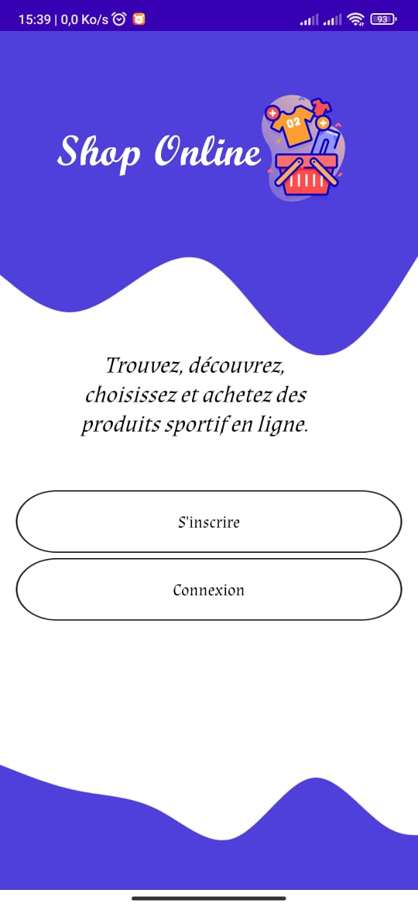
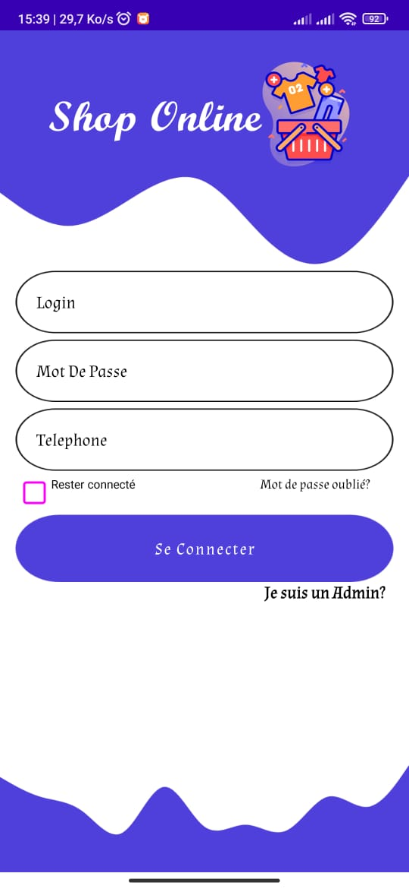
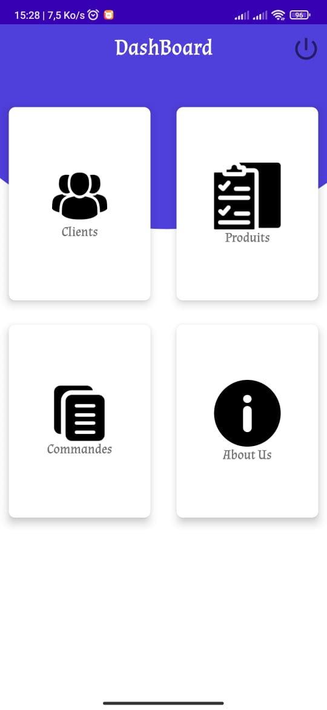
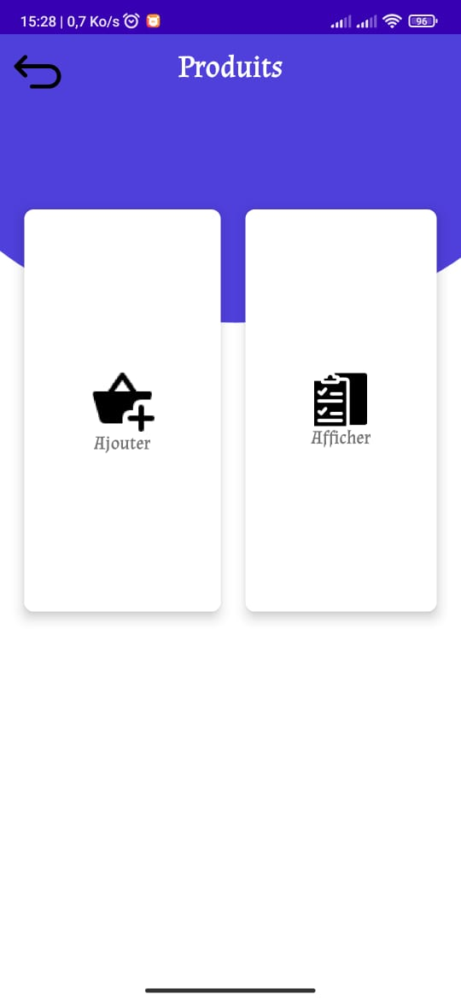
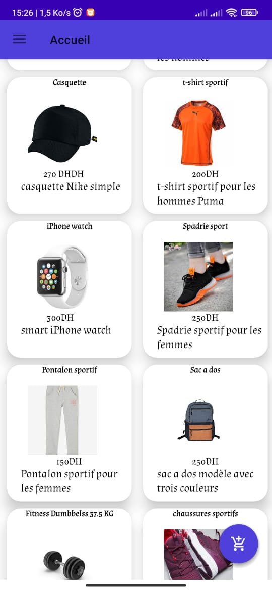
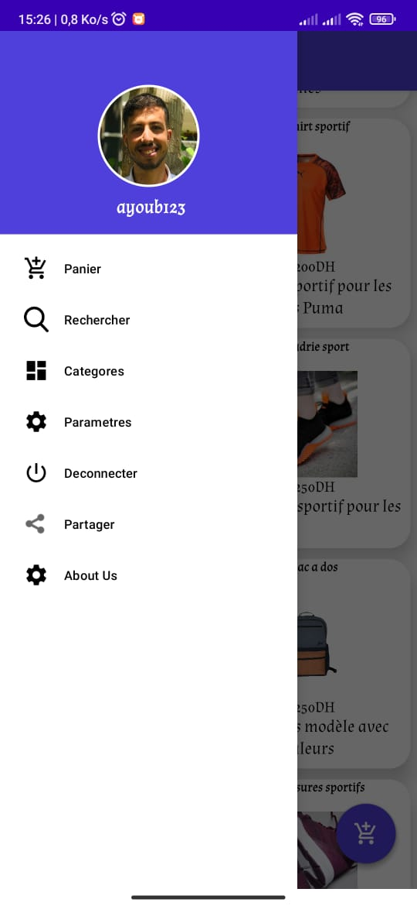

ShopOnline - Android Shopping App
 
 

🛒 Project Overview
ShopOnline is a mobile application designed for sports enthusiasts to purchase their favorite sports products. Developed using Java and Firebase, this app offers a user-friendly interface, secure authentication, and a seamless in-app purchase experience.

✨ Features
Feature	Description
🏀 Product Listings	Browse through a curated selection of sports products.
🔒 User Authentication	Secure sign-in and registration powered by Firebase.
🛍️ In-App Purchases	Smooth and secure checkout process for buying products.
🚀 Technologies Used
Java: Core language for Android development.
Firebase: Backend services for authentication, real-time database, and cloud storage.
📸 Screenshots

 
  
  

  
  
  
  

🛠️ Installation and Setup

# Clone the repository
git clone https://github.com/AyoubBoussaidi/shop-online-app.git

# Open the project in Android Studio

# Sync the project with Gradle files

# Add Firebase configuration
Add your google-services.json file in the app directory

# Run the app
Deploy on an emulator or Android device
📚 Usage
Sign Up/Login: Create an account or log in with your credentials.
Browse Products: Explore the extensive collection of sports gear.
Make a Purchase: Add items to the cart and proceed with in-app purchases.
